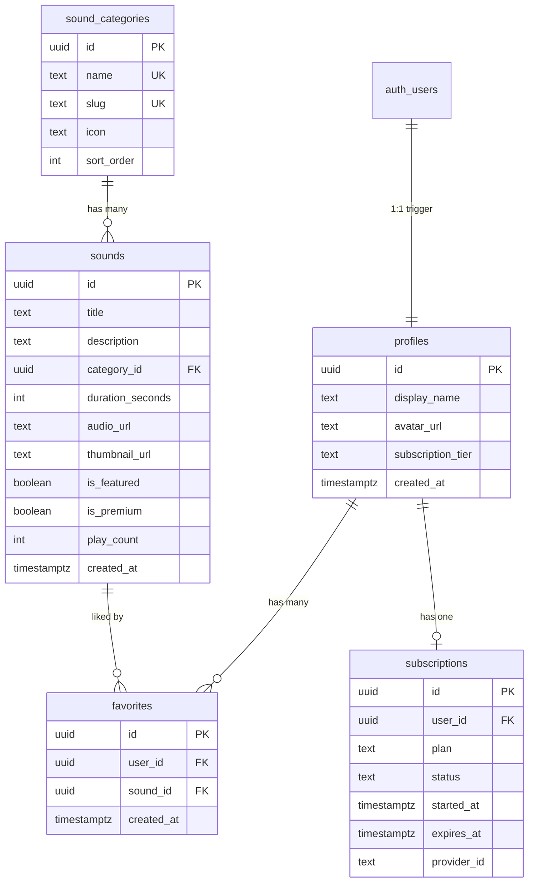
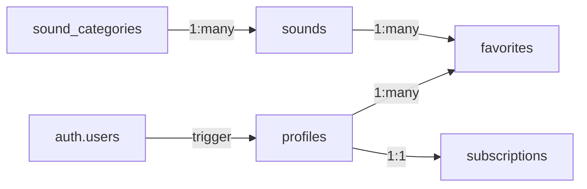

# Calmi Web — Database Schema Design

## Overview

Supabase (Postgres) schema for Calmi-Web — a mental wellness ASMR sound app with Google OAuth sign-in, ~20 curated sounds, favorites sync, and premium subscriptions.

---

## ER Diagram



---

## Relationships



---

## Tables

### `profiles`

Extends Supabase `auth.users`. Auto-created via trigger on Google sign-in.

| Column | Type | Constraints | Notes |
|--------|------|-------------|-------|
| id | uuid | PK, FK → auth.users.id | |
| display_name | text | | Google full name |
| avatar_url | text | | Google profile photo |
| subscription_tier | text | default `'free'` | `free` / `premium` |
| created_at | timestamptz | default `now()` | |

---

### `sound_categories`

Vibe/mood filters (Rain, Ocean, Nature, Ambient, White Noise, Fireplace).

| Column | Type | Constraints | Notes |
|--------|------|-------------|-------|
| id | uuid | PK | |
| name | text | UNIQUE, NOT NULL | Display name |
| slug | text | UNIQUE, NOT NULL | URL-safe identifier |
| icon | text | | Lucide icon name |
| sort_order | int | default `0` | Display order in pills |

---

### `sounds`

Core content table (~20 ASMR/wellness tracks).

| Column | Type | Constraints | Notes |
|--------|------|-------------|-------|
| id | uuid | PK | |
| title | text | NOT NULL | "Rain on Window" |
| description | text | | "Deep rain for deep sleep" |
| category_id | uuid | FK → sound_categories.id | |
| duration_seconds | int | NOT NULL | Display duration (2700 = 45:00) |
| audio_url | text | NOT NULL | Supabase Storage path |
| thumbnail_url | text | | Supabase Storage path |
| is_featured | boolean | default `false` | Shows in carousel |
| is_premium | boolean | default `false` | Locked behind subscription |
| play_count | int | default `0` | Incremented on play; powers "Most Popular" sort |
| created_at | timestamptz | default `now()` | |

**Indexes:**
- `idx_sounds_duration` on `(duration_seconds)` — Duration sort
- `idx_sounds_play_count` on `(play_count DESC)` — Most Popular sort

---

### `favorites`

User ↔ Sound relationship (heart/like).

| Column | Type | Constraints | Notes |
|--------|------|-------------|-------|
| id | uuid | PK | |
| user_id | uuid | FK → profiles.id, NOT NULL | |
| sound_id | uuid | FK → sounds.id, NOT NULL | |
| created_at | timestamptz | default `now()` | |

UNIQUE constraint on `(user_id, sound_id)`.

---

### `subscriptions`

Premium plan tracking.

| Column | Type | Constraints | Notes |
|--------|------|-------------|-------|
| id | uuid | PK | |
| user_id | uuid | FK → profiles.id, UNIQUE | One active sub per user |
| plan | text | NOT NULL | `monthly` / `yearly` |
| status | text | NOT NULL | `active` / `cancelled` / `expired` |
| started_at | timestamptz | | |
| expires_at | timestamptz | | |
| provider_id | text | | Stripe/payment provider ref |

---

## RLS Policies

| Table | SELECT | INSERT | UPDATE | DELETE |
|-------|--------|--------|--------|--------|
| profiles | Own row only | Trigger only | Own row only | — |
| sound_categories | Public | Admin | Admin | Admin |
| sounds | Public | Admin | Admin | Admin |
| favorites | Own rows | Own rows | — | Own rows |
| subscriptions | Own row | Admin/webhook | Admin/webhook | — |

---

## Storage Buckets

| Bucket | Access | Content |
|--------|--------|---------|
| `sounds` | Public read, admin write | Audio files (.mp3/.ogg) |
| `thumbnails` | Public read, admin write | Cover art (.avif/.webp) |

---

## Auto-trigger (profile creation on sign-in)

```sql
create function handle_new_user()
returns trigger as $$
begin
  insert into public.profiles (id, display_name, avatar_url)
  values (
    new.id,
    new.raw_user_meta_data->>'full_name',
    new.raw_user_meta_data->>'avatar_url'
  );
  return new;
end;
$$ language plpgsql security definer;

create trigger on_auth_user_created
  after insert on auth.users
  for each row execute procedure handle_new_user();
```
